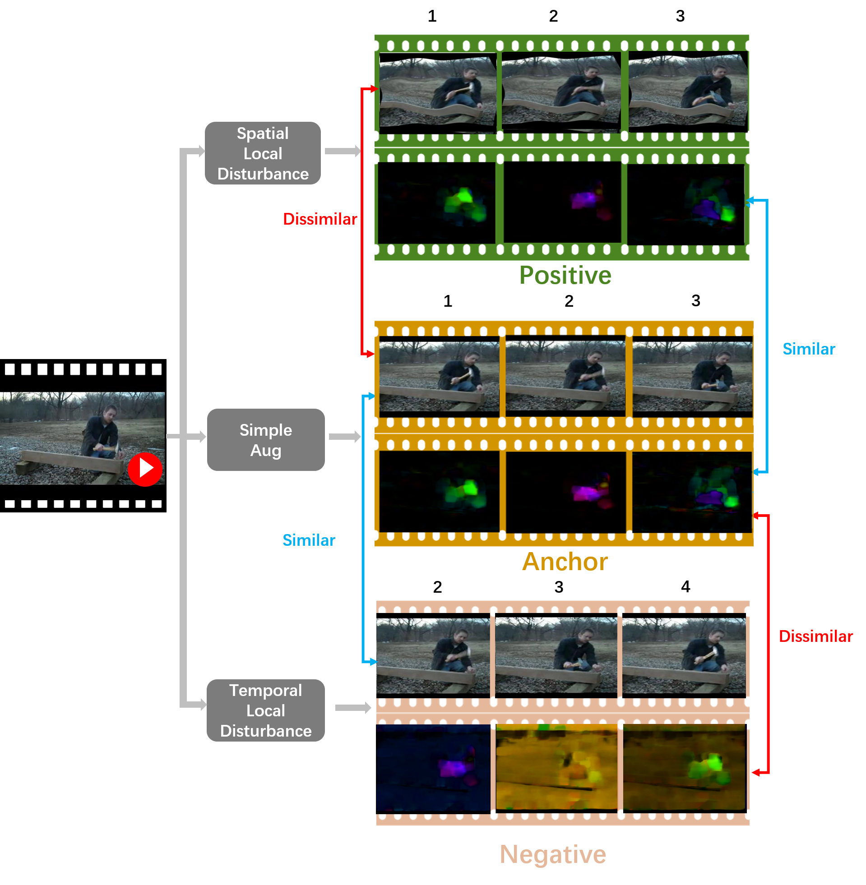
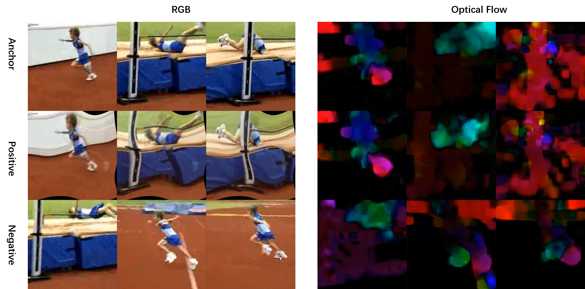
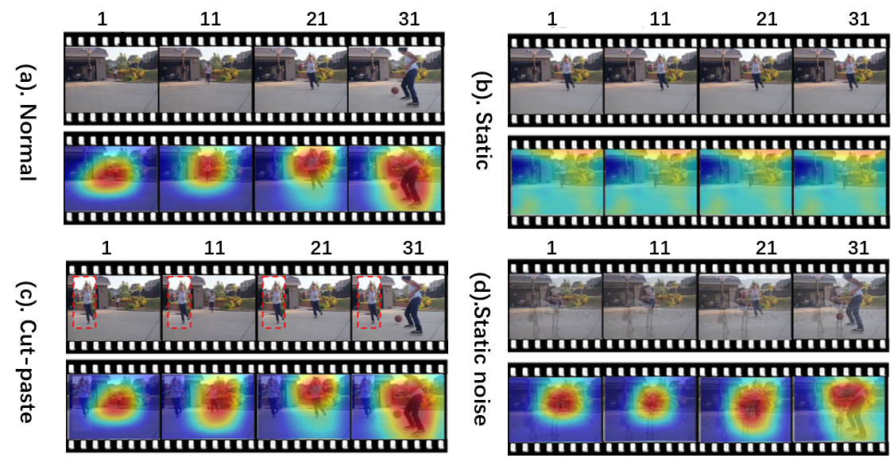

# DSM

The source code for paper [Enhancing Unsupervised Video Representation Learning by Decoupling the Scene and the Motion](https://arxiv.org/pdf/2009.05757.pdf)

[Project Website](https://fingerrec.github.io/index_files/jinpeng/papers/AAAI2021/project_website.html);

__Datasets list and some visualizations/provided weights are preparing now.__

## 1. Introduction (*scene-dominated* to *motion-dominated*)


> Video datasets are usually scene-dominated, We propose to decouple the scene and the motion (DSM) with two simple operations, so that the model attention towards the motion information is better paid. 

The generated triplet is as below:



###  What DSM learned?

**With DSM pretrain, the model learn to focus on motion region (Not necessarily actor) powerful without one label available.**




## 2. Installation

### Dataset

Please refer dataset.md for details.

### Requirements
- Python3
- pytorch1.1+
- PIL
- Intel (on the fly decode)

## 3. Structure
- datasets
    - list
        - hmdb51: the train/val lists of HMDB51
        - ucf101: the train/val lists of UCF101
        - kinetics-400: the train/val lists of kinetics-400
        - diving48: the train/val lists of diving48
- experiments
    - logs: experiments record in detials
    - gradientes:  grad check
    - visualization:
- src
    - data: load data
    - loss: the loss evaluate in this paper
    - model: network architectures
    - scripts: train/eval scripts
    - augment: detail implementation of Spatio-temporal Augmentation
    - utils
    - feature_extract.py: feature extractor given pretrained model
    - main.py: the main function of finetune
    - trainer.py
    - option.py
    - pt.py: self-supervised pretrain
    - ft.py: supervised finetune


#### DSM(Triplet)/DSM/Random
#### Self-supervised Pretrain
##### Kinetics
```bash
bash scripts/kinetics/pt.sh
```
##### UCF101
```bash
bash scripts/ucf101/pt.sh
```
#### Supervised Finetune (Clip-level)
##### HMDB51
```bash
bash scripts/hmdb51/ft.sh
```
##### UCF101
```bash
bash scripts/ucf101/ft.sh
```
##### Kinetics
```bash
bash scripts/kinetics/ft.sh
```

#### Video-level Evaluation
Following common practice [TSN](https://github.com/yjxiong/temporal-segment-networks) and [Non-local](https://github.com/facebookresearch/video-nonlocal-net).
The final video-level result is average by 10 temporal window sampling + corner crop, which lead to better result than clip-level.
Refer test.py for details.


#### Pretrain And Eval In one step
```bash
bash scripts/hmdb51/pt_and_ft_hmdb51.sh
```

**Notice: More Training Options and ablation study Can be find in scripts**

### Video Retrieve and other visualization

#### (1). Feature Extractor
As STCR can be easily extend to other video representation task, we offer the scripts to perform feature extract.
```bash
python feature_extractor.py
```

The feature will be saved as a single numpy file in the format [video_nums,features_dim] for further visualization.

#### (2). Reterival Evaluation
modify line60-line62 in reterival.py.
```bash
python reterival.py
```

## Results
### Action Recognition
#### UCF101 Pretrained (I3D)
|  Method   | UCF101  | HMDB51 |
|  ----  | ----  | ---- |
| Random Initialization  | 47.9 | 29.6| 
| MoCo Baseline | 62.3 | 36.5| 
| DSM(Triplet) | 70.7 |48.5|
| DSM  | 74.8 | 52.5| 

#### Kinetics Pretrained

### Video Retrieve (UCF101-C3D)
|  Method   | @1  | @5 | @10| @20|@50 |
|  ----  | ----  | ---- | ---- | ---- | ---- |
| DSM  | 16.8 | 33.4| 43.4 |54.6|70.7|

### Video Retrieve (HMDB51-C3D)
|  Method   | @1  | @5 | @10| @20|@50 |
|  ----  | ----  | ---- | ---- | ---- | ---- |
| DSM  | 8.2 | 25.9| 38.1 |52.0|75.0|

## More Visualization

## Acknowledgement
This work is partly based on [STN](https://arxiv.org/abs/1506.02025), [UEL](https://github.com/mangye16/Unsupervised_Embedding_Learning) and [MoCo](https://github.com/facebookresearch/moco).

## License

## Citation

If you use our code in your research or wish to refer to the baseline results, pleasuse use the followint BibTex entry.

```bash
@inproceedings{wang2021enhancing,
  title={Enhancing unsupervised video representation learning by decoupling the scene and the motion},
  author={Wang, Jinpeng and Gao, Yuting and Li, Ke and Hu, Jianguo and Jiang, Xinyang and Guo, Xiaowei and Ji, Rongrong and Sun, Xing},
  booktitle={Proceedings of the AAAI Conference on Artificial Intelligence},
  volume={35},
  number={11},
  pages={10129--10137},
  year={2021}
}
```
